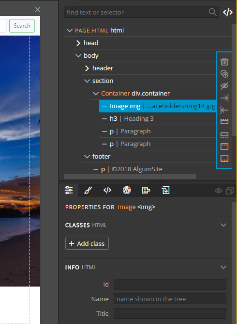
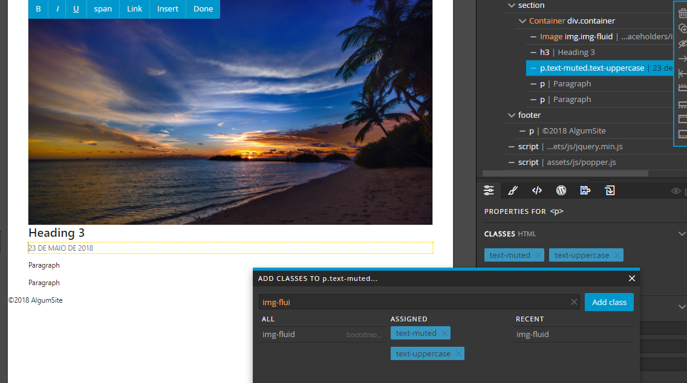

Template WordPress com Pinegrow
===============================

> Construir um template WordPress com o Pinegrow é bem simples, rápido, e não tem muitos segredos. Mas há algumas coisas que você precisa seguir para que tudo dê certo.

### Antes de começar...

Além do Pinegrow WP, você precisa ter um template HTML estático. Por motivos de aprendizado, porém, vamos montar o nosso template simples do zero, utilizando os blocos prontos do Pinegrow, certo? :wink:

Lembre-se que, para poder adicionar bibliotecas ao Pinegrow, como Bootstrap, Foundation ou as tags WordPress, você precisa criar um projeto, que nada mais é uma pasta aonde serão armazenados os arquivos do seu tema em desenvolvimento.

Basta criar uma pasta em qualquer lugar no seu HD e pedir para o Pinegrow abrir um projeto, selecione a pasta e você terá uma tela similar à fig. 1:

> #### Dica
> 
> Recomendo que faça um save a cada alteração! :wink: Eu já perdi muita coisa por não fazer isso, por isso a recomendação! :cry:

-----

Criando o esqueleto
-------------------

Com seu projeto aberto, clique em `File > New Page`, selecione `Bootstrap 4` e `index.html` (a página em branco).

Você ficará com a tela desse jeito:

Para começar, olhe na **Treeview** (a estrutura da sua página, fica no topo à direita na imagem. Veja que ele tem uma estrutura em árvore com o cabeçalho html, corpo, container e scripts.

Para começar, vamos excluir aquele container vazio clicando com o botão direito sobre ele e selecionando `Delete` (não use as teclas Delete ou Backspace, pois não funcionam para este propósito).

### Adicionando os blocos principais

Com o template 100% em branco agora, vamos adicionar alguns componentes simples. Vá até a guia de componentes do Pinegrow (ícone de uma caixinha com uma seta dobrando pra baixo), faça uma busca pelos seguintes itens e os adicione ao corpo do site (clique e arraste o componente para o body na treeview):

- header
- section
- footer

O seu treeview deve ficar como no exemplo abaixo:

> #### Por quê estamos separando o template em 3 blocos principais?
> Não se preocupe agora com isso. Mas quando adicionarmos as tags do WordPress, no bloco "section" vamos adicionar um item chamado **Site Content**.
> 
> Assim, tudo o que vir antes dele será automaticamente convertido no `header.php` e tudo o que vir após em `footer.php`, enquanto o `section` será transformado em um `index.php` com include automático do header e footer. :wink:
> 
> Você só precisa fazer isso em uma página, considerada a Master Page (veremos isso mais tarde). Nas outras páginas, você precisa ainda separar o `section` com a tag **Site Content**, mas não precisa exportá-los.

### Colocando os componentes da página

##### `header`

Começando pelo cabeçalho, vamos voltar à lista de componentes e procurar por dois itens:

- navbar
- jumbotron

Arraste os dois para dentro do bloco `header` na treeview, de modo que fique como na fig. 7:

##### `footer`

No rodapé, vamos apenas adicionar um parágrafo. Basta procurar pelo componente `p` na lista de componentes (TEXT & IMAGES > p). E adicione ao footer.

##### `section` 

No conteúdo principal, vamos adicionar os seguintes itens:

- container
- row
- column
- card

A diferença é que, neste caso, vamos adicionar um dentro do outro, ficando:

- container
	- row
		- column
			- card

Não se preocupe que a linha tem apenas um item por enquanto, pois é tudo o que precisamos para que o template funcione inicialmente.

Seu treeview e section devem ficar como abaixo:

-----

Aumentando um pouco mais o esqueleto...
---------------------------------------

Além do `index.html`, vamos criar mais duas páginas: `singular.php` e `page.html`. Mas não precisamos criá-las do zero.

Na sua lista de projeto, clique com o botão direito sobre `index.html` e selecione "Duplicate":

Após criar ambas, você ficará com o seguinte projeto:

### Montando `page.html`

Abra o arquivo `page.html` e exclua o conteúdo dentro de `<container>`, deixando apenas `section > container`:

> #### Dica
> 
> Caso queira, para ajudar na criação desta página, pode excluir o **Jumbotron** em `page.html`, pois não o utilizaremos aqui. 

Adicione os seguintes ítens ao container:

- image
- h3
- p

O seu `section` deve ficar assim:

Vamos ajustar algumas coisas na imagem também:

Selecione a imagem na treeview, depois clique no ícone de "ajustes" (o que tem três linhas com um pontinho, tipo um mixer):

Clique em **Add class** e procure por `img-fluid`, clicando na classe. Você verá as classes adicionadas em "ASSIGNED".

> #### Dica
> 
> Pode adicionar mais classes e até classes customizadas através deste seletor. Ele faz uma varredura de todas as classes no seu CSS! :smile:

### Montando `single.html`

Abra o arquivo `single.html` e faça o mesmo que em `page.html`: exclua o conteúdo dentro de `<container>`, deixando apenas `section > container`.

Depois, adicione os seguintes componentes:

- img
- h3
- p
- p
- p

Note que adicionamos dois parágrafos a mais aqui. A imagem você deve fazer o mesmo que em `page.html`: vá até a guia de ajustes e adicione a classe `img-fluid`.

No primeiro parágrafo, altere o conteúdo para uma data de exemplo como conteúdo. Vá para a guia de ajustes e adicione as classes `text-muted` e `text-uppercase`

No segundo parágrafo, adicione as classes `lead` e `text-muted`.

Com isso, temos o nosso esqueleto pronto! Hora de adicionar funcionalidades simples!

-----

Adicionando funcionalidades do WordPress
----------------------------------------

### `index.html`

Começando pela página inicial do seu template. Abra o arquivo `index.html`. Clique na guia com o ícone do WordPress e ative a funcionalidade WP nesta página:

Você verá que aparece um formulário para preencher sobre o template criado:

Estes campos são:

- **Esta é a Página mestre**: A página mestre que define o cabeçalho e rodapé do website, assim como componentes globais. Apenas 1 página mestre por template é permitida
- **Theme Name**: o nome do seu tema, a ser exibido no seletor do WordPress
- **Slug do Tema**: um nome url-safe do tema, deve conter apenas letras minúsculas, números e underscore (`_`)
- **Pasta do Tema**: local para onde será exportado o tema, normalmente uma pasta local para teste com WordPress
- **URL para prévia do template**: uma URL de teste com a página que usa o template
- **Não exportar esta página**: faz o Pinegrow ignorar alguns templates que não utiliza
- **Não exporte partes do template**: bloqueia o Pinegrow de exportar o `header.php` e `footer.php` automaticamente, é mais utilizado nas outras páginas que não são o Master Page

Preencha os dados obrigatórios, mantenha `This is the Master Page` selecionado e as duas outras checkboxes em branco. Vamos adicionar algumas funcionalidades do WordPres. :smile:

> #### Importante
> 
> Abra as páginas `page.html` e `single.html`, na treeview de cada uma delas, selecione o elemento principal `html` (precisa clicar, pois não é selecionado automaticamente!) e, na guia WordPress, em "WordPress Site", desabilite o "This is the master Page", preencha "User Master Page" com `index.html` e selecione "don't export template parts".
> 
> É importante que faça isso para cada novo template, pois o projeto pode ter apenas uma master page! Mais de uma pode causar erros!
>
> 

### Navegação

Na treeview, selecione `header > navbar > navbar collapse e > list`. Na guia do WordPress, procure por "Nav menu" e adicione este item à `list`.

No formulário que aparecerá, há dois campos importantes e necessários para que o menu funcione bem:

- **Menu**: o nome do menu dentro do WordPress
- **Menu Type**: o tipo do menu, deixe selecionado o Bootstrap 4, para formatar automaticamente

### Jumbotron

Selecione o Jumbotron na treeview, na guia WordPress adicione o ítem "Sidebar - Smart" para este bloco.

No formulário que aparecer, além de definir um id (por exemplo "slider-home"), deixe selecionado "Register Sidebar" e crie um nome para a sidebar (ex.: Slider Home).

Adicione ao Jumbotron outros itens WordPress: "is_home" e "is_front_page", deixe os valores padrões nestes.

### Section

Selecione `section` na treeview e, na guia WordPress, procure por "Site content" e adicione a este elemento.

Como dito anteriormente, qualquer elemento que vir antes do `section` após a inclusão deste item (`header`) será adicionado automaticamente ao `header.php`, assim como qualquer item que vir após este elemento será adicionado ao `footer.php` ao exportar o template.

#### Listando Posts na Home

Dentro da Section, selecione a coluna com o card de posts. À esta coluna, adicione o item WordPress "The Loop", não precisa preencher nada por enquanto, mas deixe o "Clear Bootstrap 3 Columns" (eu sei, estamos usando BS4, mas vale pra ele também).

Aproveite para ir até a guia de ajustes e adicione a classe `mb-4` para a coluna. Caso contrário, se houver mais de uma linha, os posts ficarão grudados:

Selecione a imagem do card, adicione o elemento WordPress "The Post Thumbnail", e selecione "Add Has Thumb Check" no formulário que aparecer.

Adicione, também, `card-img-top` no campo "Class Attribute" e defina "Replace" como "element".

Não está na imagem, mas no campo "Size", defina como `thumbnail` (isso é IMPORTANTE!).

Selecione o primeiro título na treeview e adicione o elemento WordPress "the title", em "Replace" no formulário, coloque "Content".

Selecione o segundo título na treeview e adicione o elemento WordPress "date". No formulário, no campo "Format" coloque "d M Y", deixe "Show Same Days" selecionado e "Replace" defina como "Content".

Selecione o parágrafo do card na treeview e adicione os elementos "Has_excerpt" e "Post Excerpt - Smart", não precisa alterar nada aqui.

Selecione o botão, altere o texto dele para algo como "Leia Mais" e, na Treeview, adicione o item "The Permalink" ao botão. Em "Replace", coloque "href attribute (with esc_url)".

### `single.html`

Abra o arquivo `single.html`, certifique-se de que a propriedade "WordPress Site" foi adicionada à página (selecione elemento `html` na treeview) e que as propriedades estão da seguinte forma:

Selecione o elemento `section` e defina o elemento "Site Content" para ele, tal como foi feito no `index`:

Selecione o elemento `container` e adicione o elemento WordPress "the Loop" para ele:

Selecione a imagem e defina o elemento WordPress para ela. Deixe "Size" em branco, defina "Class Attribute" como "img-fluid", selecione "Add Has Thumb Check" e "Replace" como "Element".

Selecione o primeiro título e adicione à ele o elemento WordPress "The Title", defina "Replace" como "Content":

Selecione parágrafo com a data e adicione à ele o elemento WordPress "The Date", coloque "Format" como "d M Y" e defina "Replace" como "Content":

Selecione parágrafo abaixo da data (o com a fonte maior) e adicione os seguintes elementos WordPress: "if has_excerpt" e "the_excerpt". No formulário, defina "Replace" como "Content":

Selecione o último parágrafo e adicione o elemento WordPress "the Content", definindo "Replace" como "Element":

### `page.html`

Abra o arquivo `page.html`, certifique-se de que a propriedade "WordPress Site" foi adicionada à página (selecione elemento `html` na treeview) e que as propriedades estão da seguinte forma:

Selecione o elemento `section` e defina o elemento "Site Content" para ele, tal como foi feito no `index`:

Selecione o elemento `container` e adicione o elemento WordPress "the Loop" para ele:

Selecione a imagem e defina o elemento WordPress para ela. Deixe "Size" em branco, defina "Class Attribute" como "img-fluid", selecione "Add Has Thumb Check" e "Replace" como "Element".

Selecione o primeiro título e adicione à ele o elemento WordPress "The Title", defina "Replace" como "Content":

Selecione o parágrafo e adicione o elemento WordPress "the Content", definindo "Replace" como "Element":

-----

Exportando o Tema
-----------------

Salve o template e, depois, vá ao menu "WordPress > Export Theme". Experimentando o tema criado neste tutorial, ele ficará como nas figuras abaixo:

### `index.html`

### `page.html` (Sem Imagem)

### `page.html` (Com Imagem)

### `single.html`

